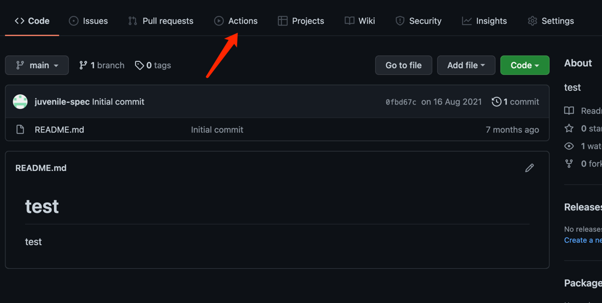
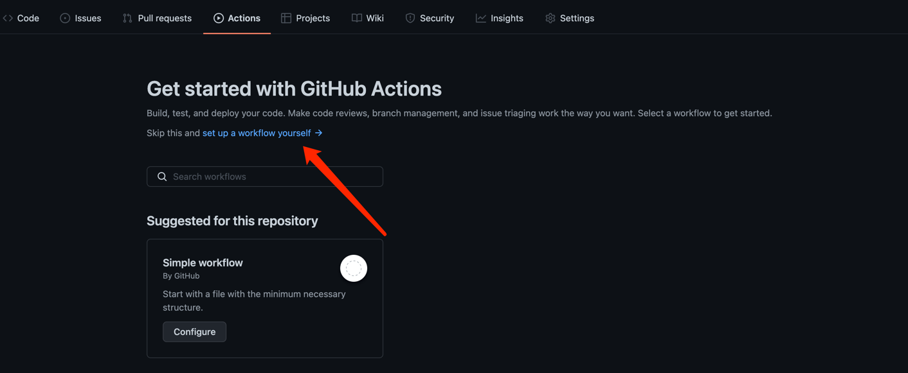
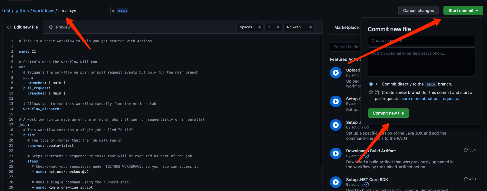
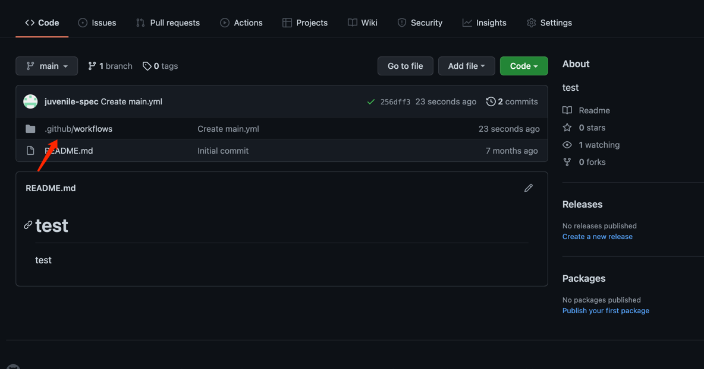
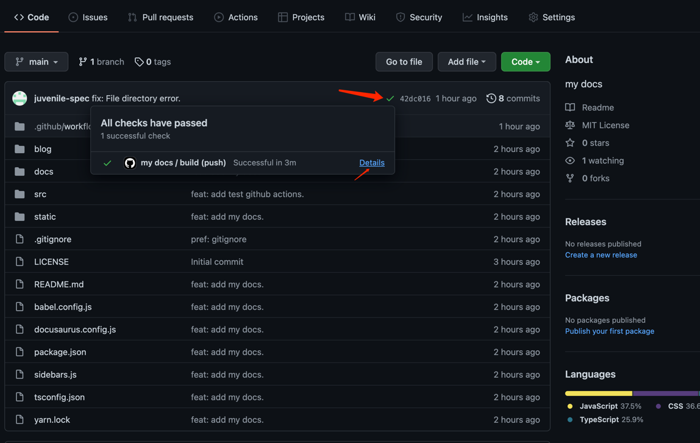
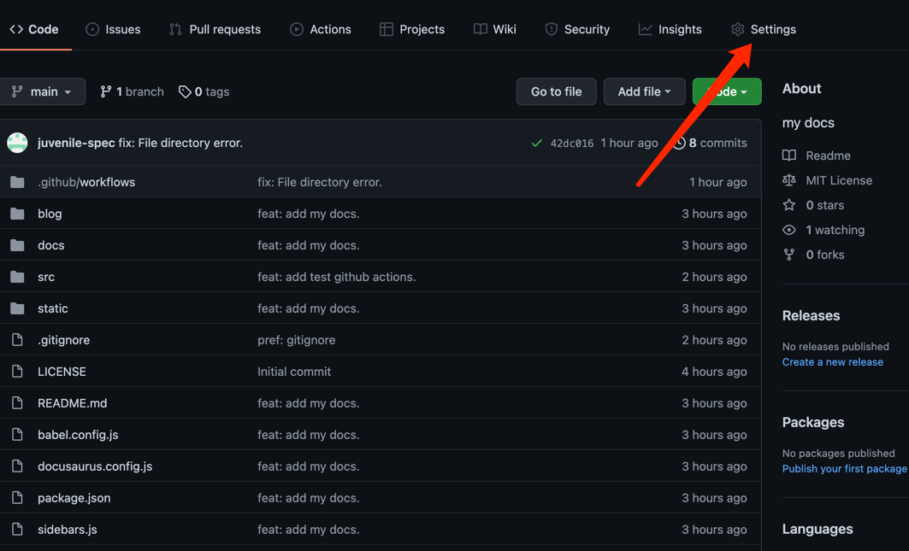
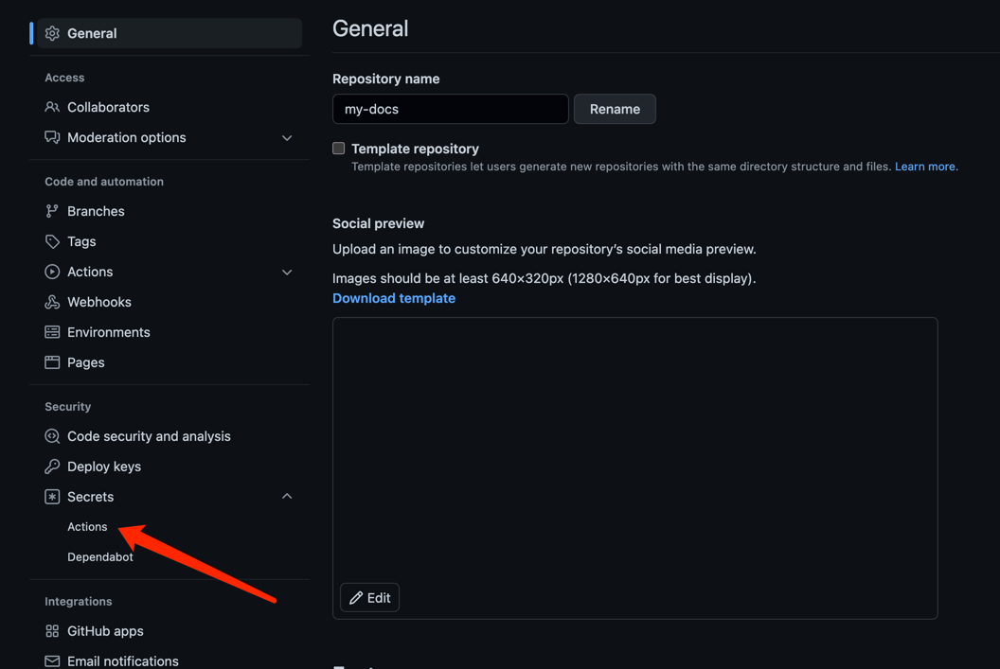
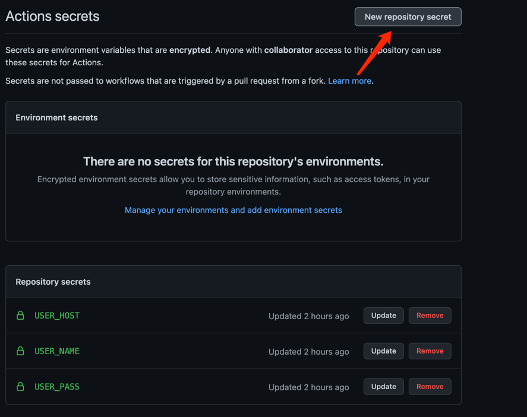
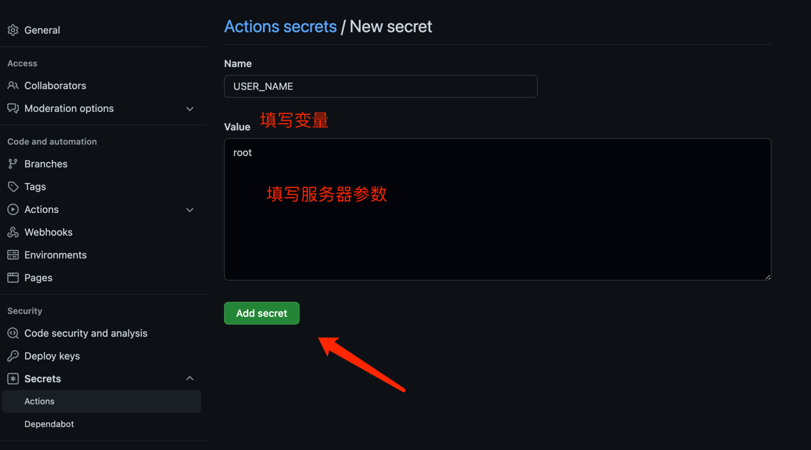

----

>(此篇为需要有自己的服务器才行)

## 1.什么是GitHub Actions？
>GitHub Actions是GitHub推出的一款持续集成（CI/CD）服务，它给我们提供了虚拟的服务器资源，让我们可以基于它完成自动化测试、集成、部署等操作。

### 传统的前端项目开发流程：

1. 前端人员完成所有开发
2. 推送代码
3. 打包生成静态资源文件
4. 推送至服务端
- ...依次循环

可以看到传统的前端项目开发流程其实并不复杂，但是很繁琐，开发人员需要不断地重复2~4步骤，若是遇到加急bug，那么这些不太复杂的操作就会浪费不少时间。

### 使用GitHub Actions的前端项目开发流程：

1. 前端人员完成所有开发
2. 推送代码
3. GitHub Actions自动部署
- ...依次循环  

使用GitHub Actions后工作就变得非常简单了，开发人员只需要专注开发，每次推送完代码后便自动完成了部署，免去了很多繁琐的操作。  

大家可以简单的把Actions理解为脚本，一个Action就是一个自动化部署脚本，GitHub官方为了方便大家操作，允许发布自己的Action到Actions市场去，这样一些常用的部署脚本就不需要自己写了，只需要使用别人造好的轮子即可。

## 2.概念介绍

>在使用GitHub Actions之前，它的几个基本概念必须要了解一下：

**Workflows（工作流程）**

持续集成的运行过程称为一次工作流程，也就是我们项目开始自动化部署到部署结束的这一段过程可以称为工作流程，一个工作流程中由一个或者多个任务（job）组成。

**Jobs（任务）**  

一个工作流程中包含多个任务，简单来说就是一次自动部署的过程中，需要完成一个或多个任务，这些任务里面又包含了多个步骤（step）。

**Step（步骤）**  

我们开发项目需要按照一个一个的步骤来进行，自动部署也一样，在一个任务中，步骤需要一步步的完成。

**Action（动作）**  

每个步骤（step）可以包含一个或多个动作，比如我们在一个步骤中执行打包命令这个Action。

---

上面4点是GitHub Actions中几个大的概念，也很好理解，大家可以把它想象为一条完整的流水线，流水线包含的几个操作要点如下：
```
workflow->job->step->action
```


## 3.语法简介
上面的概念介绍只是从宏观层面解读的，具体如何实现还需要我们了解具体的额语法。  
就好比一个工人修房子，具体步骤是知道了，那么具体工具还需要确定，这些工具就是我们需要了解的GitHub Actions语法。

### 3.1 name

定义workflow的名称，如果没有定义，则会默认使用执行脚本文件名作为workflow名称，实例代码如下：
```
name: demo
```


### 3.2 on

触发workflow的条件或者事件，比如push的时候就像执行workflow，实例代码如下：

```
#单个事件
on: push

#多个事件列表
on: [push, pull_request]

#当main分支发生push操作时执行workflow
on:
  push:
    branches:
      - main
```

### 3.3 jobs

jobs是一个workflow的核心任务，我们大部分的操作在jobs中完成，我们的任务（job）放在jobs这个集合下，每一个job有以下几个核心的字段组成：

**（1）jobs.<job_id>**

jobs中每一项任务都有任务id，实例代码如下：

```
jobs:
  my_first_job:   // 任务id
    name: My first job
  my_second_job:
    name: My second job
```

**（2）jobs.<job_id>.name**

每一项任务具有任务名称，好比我们做每一项工作时都有一个工作名称，实例代码如下：

```
jobs:
  my_first_job:  
    name: My first job  // 任务任务名称
  my_second_job:
    name: My second job
```

**（3）jobs.<job_id>.needs**

needs字段用来指定当前任务的一些依赖关系，比如一个任务依赖于另外两个任务，实例代码如下：

```
jobs:
  job1:
  job2:
    needs: job1
  job3:
    needs: [job1, job2]
```

上面代码展示了三个任务之间的依赖关系，所以执行顺序应该是job1、job2、job3.

**（3）jobs.<job_id>.runs-on**

该字段用来指定命令的运行虚拟机环境，可以理解为我们的任务要在哪个环境中执行，实例代码如下：

```
runs-on: ubuntu-18.04
```

**GitHub Actions给我们提提供的运行环境主要有以下几种：**

- ubuntu-latest，ubuntu-18.04或ubuntu-16.04
- windows-latest，windows-2019或windows-2016
- macOS-latest或macOS-10.14

**（4）jobs.<job_id>.steps**

step是job中的重点，一个job可以包含多个步骤，比如一个项目就是一个任务，我们需要分为多个步骤来完成这个项目，实例代码如下：

每个步骤包含下面三个字段：

```
jobs.<job_id>.steps.name：步骤名称。
jobs.<job_id>.steps.run：该步骤运行的命令或者 action。
jobs.<job_id>.steps.env：该步骤所需的环境变量。
```

上面代码中run就是我们该步骤需要执行的命令，比如打包命令：npm run build。当然也可以使用人家造好的轮子，直接使用人家的action。  

---

以上只是简单介绍了GitHub Actions中重要的一些概念和语法，以满足我们基本的自动化部署操作，更多详细语法可以移步官网：


**[GitHub docs](https://docs.github.com/cn/actions)**

---

**以上内容摘抄至 <https://zhuanlan.zhihu.com/p/433426848>**

---

## 4.实践操作

### 4.1 准备工作

1. 前端项目
2. GitHub账号
3. 服务器资源（自行配置nginx）


### 4.2  GitHub操作

1. 在GitHub上生成一个项目
2. 将本地项目推送到GitHub刚刚新建的项目上（只要将本地的能推到GitHub就行不过多讲解）

### 4.3  步骤
1. 打开刚刚GitHub新建项目的首页，选择Actions



2. 选择 set up a workflow yourself 新建（也可以选择模板，看个人需求。）



3. 三部曲





初始会运行一次有个小绿灯



4. 修改刚刚那个生成的.yml 代码

```
name: test
on:
  #监听push操作
  push:
    branches:
      # mian分支，你也可以改成其他分支
      - main
jobs:
  # 任务ID
  build:
    # 运行环境
    runs-on: ubuntu-latest
    # 步骤
    steps:
    # 使用别人的action
    - uses: actions/checkout@v2
    # 步骤名称
    - name: npm install
      # 步骤执行指令
      run: npm install
    - name: npm run build
      run: npm run build
    # 命名这个任务为发布Deploy
    - name: Deploy
      # 因为构建之后，需要把代码上传到服务器上，所以需要连接到ssh，并且做一个拷贝操作
      uses: cross-the-world/scp-pipeline@master
      env:
        WELCOME: "ssh scp ssh pipelines"
        LASTSSH: "Doing something after copying"
      with:
        host: ${{ secrets.USER_HOST }}
        user: ${{ secrets.USER_NAME }}
        pass: ${{ secrets.USER_PASS }}
        connect_timeout: 10s
        local: './dist/*'  #本地打包后的产物
        remote: /var/www/dist  #看你服务器所在的文件夹

```

**在deploy这个步骤中，使用了一个别人写好的action，主要目的就是推送静态资源到服务端，几个重点字段解释：**

- host：服务器ip
- user：服务器登录用户
- pass：服务器登录密码
- connect_timeout：登陆超时限制
- local：本地的静态资源文件，Vue项目打包后会生成dist文件夹
- remote：服务端静态资源文件存放路径

5. 配置密钥






6. 完结

配置完推送到GitHub可以点击详情查看。


