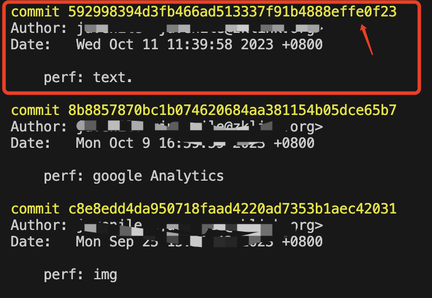

---

## git 命令

```git
git init  //初始化一个本地仓库

git clone xxx  //克隆项目

git add xxx  //添加xxx文件到缓冲区

git add .  //添加所有文件到缓冲区

git add --all  //添加所有文件到缓冲区(all可以添加被手动删除的文件而加"."不行)

git commit -m  'xxx'  //提交说明

git push  //推送到远程库

git fetch //从远程分支拉取代码

git branch  //查看分支 带*的表示当前分支

git branch -d xxx  //删除xxx分支(本地分支)

git branch  xxx  //创建xxx分支

git checkout xxx  //切换xxx分支

git checkout -b xxx  //创建分支并切换到创建的分支 （本地分支）

git push  -u  origin xxx  //第一次推送到远程xxx分支

git pull  //拉取线上分支代码

git merge xxx  //合并xxx的内容到当前分支

git remote  //查看当前的远程仓库（不是分支）

git push origin --delete xxx  //以origin仓库为例（可通过git remote查看仓库）删除xxx分支（只删除远程，本地看之前是否存在可通过git branch -d xxx 删除）
```

## git 规范

```
<type>(<scope>): <subject>
```

**注意冒号 : 后有空格**

例如

```
feat(miniprogram): 增加了小程序模板消息相关功能
```

> scope 选填表示 commit 的作用范围，如数据层、视图层，也可以是目录名称 subject 必填用于对 commit 进行简短的描述 type 必填表示提交类型。

**值有以下几种：**

|   类型   |                    说明                    |
| :------: | :----------------------------------------: |
|   feat   |               新功能 feature               |
|   fix    |                  修复 bug                  |
|   docs   |                  文档注释                  |
|  style   |       代码格式(不影响代码运行的变动)       |
| refactor | 重构、优化(既不增加新功能，也不是修复 bug) |
|   perf   |                  性能优化                  |
|   test   |                  增加测试                  |
|  chore   |          构建过程或辅助工具的变动          |
|  revert  |                    回退                    |
|  build   |                    打包                    |

**用例：**

```
 feat(transaction): listen transaction changes, show result dialog

 fix(swap): slippage calculation;
```

## 其他

### git 查看已有分支情况：

```git
git branch -a
```

### git 拉取更新远程分支列表

```git
git remote update origin --prune
```

### 查看当前的上游代码库

```git
git remote -v
```

### 设置一个上游代码库，为 fork 的仓库地址

```git
git remote add upstream git@github.com:xxx/xxx.git
```

### 版本回退

```git
通过 git log 找到对应版本号

git reset --hard 592998394d3fb466...

git push -f 强推上去

```


