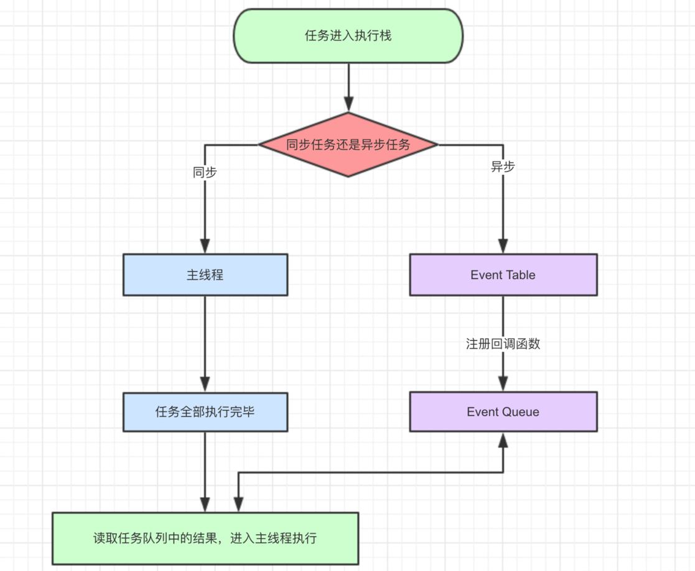
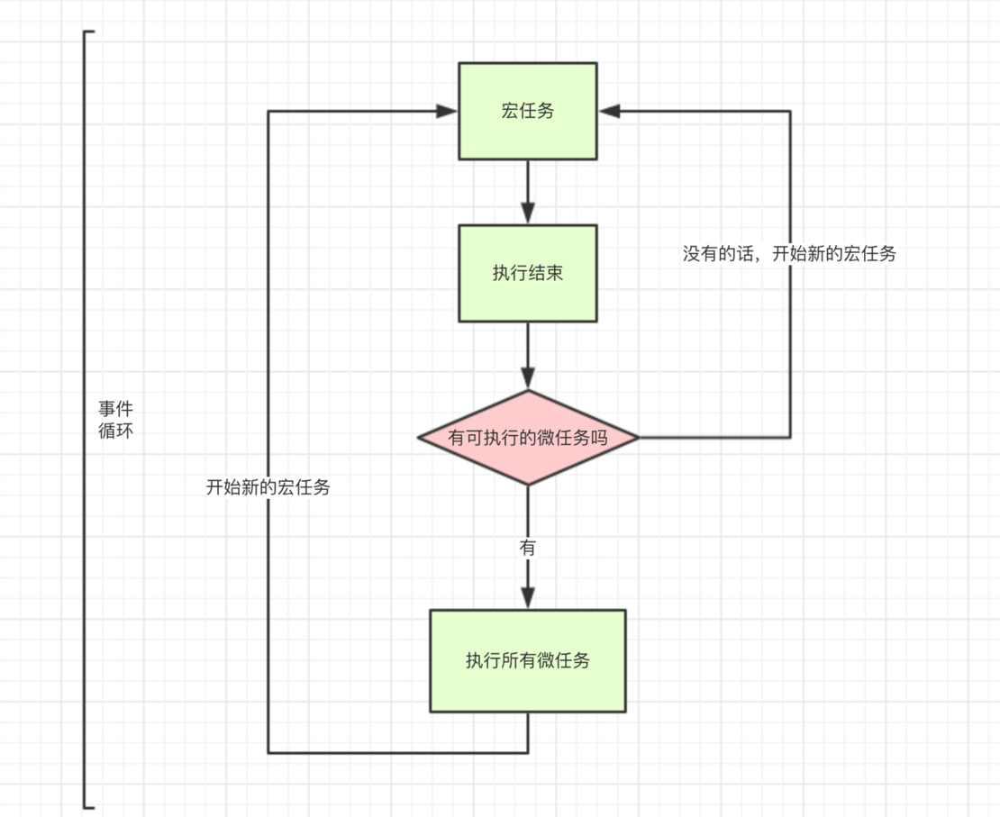
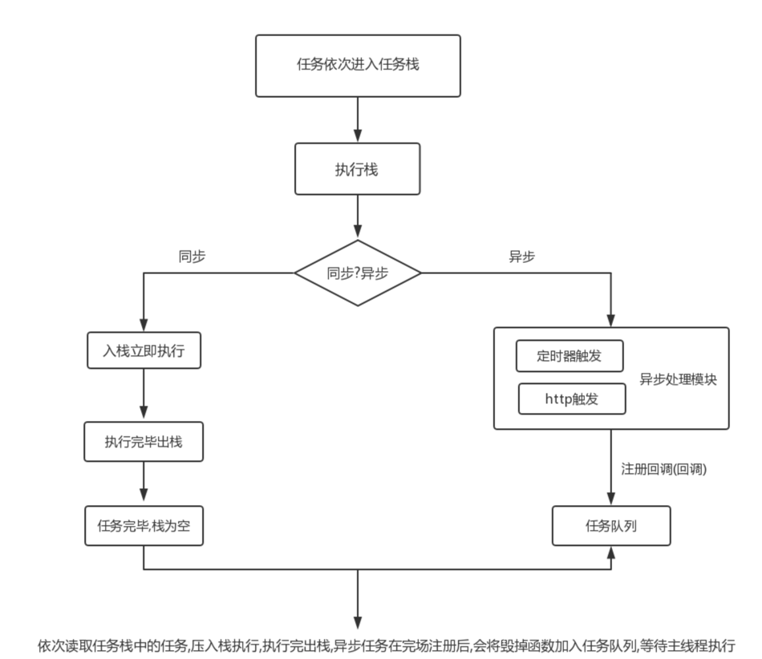

----

## 1.js执行机制





1. 同步任务:会立即执行的任务
2. 异步任务:不会立即执行的任务(异步任务又分为宏任务与微任务)

**常见的宏任务**:整体的script代码,setTimeout setInterval
**常见的微任务**:Promise，process.nextTick

####  **宏任务是由宿主发起的，而微任务由JavaScript自身发起**。

|                    | 宏任务（macrotask）                                          | 微任务（microtask）                                          |
| :----------------- | :----------------------------------------------------------- | :----------------------------------------------------------- |
| 谁发起的          | 宿主（Node、浏览器）                                         | JS引擎                                                       |
| 具体事件           | 1. script (可以理解为外层同步代码)2. setTimeout/setInterval3. UI rendering/UI事件4. postMessage，MessageChannel5. setImmediate，I/O（Node.js） | 1. Promise2. MutationObserver3. Object.observe（已废弃；Proxy 对象替代）4. process.nextTick（Node.js） |
| 谁先运行           | 后运行                                                       | 先运行                                                       |
| 会触发新一轮Tick吗 | 会                                                           | 不会                                                         |


## 2.浏览器运行机制

### 1.浏览器页面的渲染流程

1. 解析html得到DOM树

2. 解析css得到CSS树

3. 合并得到render树

4. 布局，当页面有元素的尺寸、大小、隐藏有变化或增加、删除元素时，重新布局计算，并修改页面中所有受影响的部分

5. 绘制，当页面有元素的外观发生变化时，重新绘制

6. GUI线程将得到的各层的位图（每个元素对应一个普通图层）发送给Browser进程，由Browser进程将各层合并，渲染在页面上

### 2.回流与重绘

> 布局是页面首次加载时进行的操作，重新布局即为回流。

> 绘制是页面首次加载时进行的操作，重新绘制即为重绘。

当页面的某部分元素发生了尺寸、位置、隐藏发生了改变，页面进行回流。得对整个页面重新进行布局计算，将所有尺寸，位置受到影响的元素回流。  
当页面的某部分元素的外观发生了改变，但尺寸、位置、隐藏没有改变，页面进行重绘。（同样，只重绘部分元素，而不是整个页面重绘）  
**回流的同时往往会伴随着重绘，重绘不一定导致回流。**所以回流导致的代价是大于重绘的。


## 3.js基础

### 1.原型与原型链与继承

#### 一、prototype

在JavaScript中，每个函数都有一个prototype属性，这个属性指向函数的原型对象。

#### 二、__proto__

这是每个对象(除null外)都会有的属性，叫做__proto__，这个属性会指向该对象的原型。

#### 原型的概念：

每一个javascript对象(除null外)创建的时候，就会与之关联另一个对象，这个对象就是我们所说的原型，每一个对象都会从原型中“继承”属性。

#### 原型链的概念:

每个构造函数都有一个原型对象，原型对象都包含一个指向构造函数的指针，而实例都包含一个指向原型对象的内部指针。那么假如我们让原型对象等于另一个类型的实例，结果会怎样？显然，此时的原型对象将包含一个指向另一个原型的指针，相应地，另一个原型中也包含着一个指向另一个构造函数的指针。假如另一个原型又是另一个类型的实例，那么上述关系依然成立。如此层层递进，就构成了实例与原型的链条。这就是所谓的原型链的基本概念。

当我们访问对象的一个属性或方法时，它会先在对象自身中寻找，如果有则直接使用，如果没有则会去原型对象中寻找，如果找到则直接使用。如果没有则去原型的原型中寻找,直到找到Object对象的原型，Object对象的原型没有原型，如果在Object原型中依然没有找到，则返回undefined。


#### es5继承方式

```js
function Person(){
  this.name ='person私有属性'
}
/* 
Person.prototype ={
     constructor:Person, //赋值形式需要指定原型对象,否则没有constructor指向当前对象,适用于多个方法一起
     eat(v){
       return v;
     },
     info(v){
       return v;
     }
 }
 Person.prototype.add = function(v){ 
     //直接属性下不需要,适用于单个方法形式
     return v+1;
 }
 */
Object.assign(Person.prototype,{  //和上面的是一样的
  say(v){
    return v+1
  },
  add(v){
    return v+1
  }
})
Student.prototype = new Person()
function Student() {
  this.abc = '私有属性'
}
let s = new Student()
```

#### es6 class继承方式

```js
class Person{
         constructor() {
            this.a = '私有属性'
         }
         static foo(){
             return '静态方法'
         }
     }
class Student extends Person{
         constructor(props) {
             super(props); //super不调用使用this会报错,不传参拿不到父亲的东西结果为undefined
         }

     }
let result = new Student();
```

### 2.常用数组方法:

#### 不会改变原来数组的有：

concat()---连接两个或更多的数组，并返回结果。

every()---检测数组元素的每个元素是否都符合条件。

some()---检测数组元素中是否有元素符合指定条件。

filter()---检测数组元素，并返回符合条件所有元素的数组。

indexOf()---搜索数组中的元素，并返回它所在的位置。

join()---把数组的所有元素放入一个字符串。

toString()---把数组转换为字符串，并返回结果。

lastIndexOf()---返回一个指定的字符串值最后出现的位置，在一个字符串中的指定位置从后向前搜索。

map()---通过指定函数处理数组的每个元素，并返回处理后的数组。

slice()---选取数组的的一部分，并返回一个新数组。

valueOf()---返回数组对象的原始值。

#### 会改变原来数组的有：

pop()---删除数组的最后一个元素并返回删除的元素。

push()---向数组的末尾添加一个或更多元素，并返回新的长度。

shift()---删除并返回数组的第一个元素。

unshift()---向数组的开头添加一个或更多元素，并返回新的长度。

reverse()---反转数组的元素顺序。

sort()---对数组的元素进行排序。

splice()---用于插入、删除或替换数组的元素。


### 3.字符串常用方法:


#### 1、toLowerCase():

>把字符串转为小写，返回新的字符串。

```js
var str="Hello World";
var str1=str.toLowerCase();
console.log(str); //Hello World
console.log(str1); //hello world
```

#### 2、toUpperCase():

>把字符串转为大写，返回新的字符串。

```js
var str="hello world";
var str1=str.toUpperCase();
console.log(str); //hello world
console.log(str1); //HELLO WORLD
```

#### 3、charAt():

>返回指定下标位置的字符。如果index不在0-str.length(不包含str.length)之间，返回空字符串。

```js
var str="hello world";
var str1=str.charAt(6);
console.log(str1); //w
```

#### 4、charCodeAt():

> 返回指定下标位置的字符的unicode编码,这个返回值是 0 - 65535 之间的整数。

```js
var str="hello world";
var str1=str.charCodeAt(1);
var str2=str.charCodeAt(-2); //NaN
console.log(str1); //101
```

**注意：如果index不在0-str.length(不包含str.length)之间，返回NaN。**

#### 5、indexOf():

>返回某个指定的子字符串在字符串中第一次出现的位置

```js
var str="Hello World";
var str1=str.indexOf("o");
var str2=str.indexOf("world");
var str3=str.indexOf("o",str1+1);
console.log(str1); //4 默认只找第一个关键字位置，从下标0开始查找
console.log(str2); //-1 没有找到
console.log(str3); //7
```

**注意：indexOf()方法对大小写敏感，如果子字符串没有找到，返回-1。第二个参数表示从哪个下标开始查找，没有写则默认从下标0开始查找。**

#### 6、lastIndexOf():

>返回某个指定的子字符串在字符串中最后出现的位置。

```js
var str="Hello World";
var str1=str.lastIndexOf("o");
var str2=str.lastIndexOf("world");
var str3=str.lastIndexOf("o",str1-1);
console.log(str1); //7
console.log(str2); //-1
console.log(str3); //4
```

**注意：lastIndexOf()方法对大小写敏感，如果子字符串没有找到，返回-1。第二个参数表示从哪个下标开始查找，没有写则默认从最后一个字符处开始查找。**

#### 7、slice():

>返回字符串中提取的子字符串。

```js
var str="Hello World";
var str1=str.slice(2); //如果只有一个参数，则提取开始下标到结尾处的所有字符串
var str2=str.slice(2,7); //两个参数，提取下标为2，到下标为7但不包含下标为7的字符串
var str3=str.slice(-7,-2); //如果是负数，-1为字符串的最后一个字符。提取从下标-7开始到下标-2但不包含下标-2的字符串。前一个数要小于后一个数，否则返回空字符串

console.log(str1); //llo World
console.log(str2); //llo W
console.log(str3); //o Wor
```

#### 8、substring():

>提取字符串中介于两个指定下标之间的字符。

```js
var str="Hello World";
var str1=str.substring(2)
var str2=str.substring(2,2);
var str3=str.substring(2,7);
console.log(str1); //llo World
console.log(str2); //如果两个参数相等，返回长度为0的空串
console.log(str3); //llo W
```

**注意：substring()用法与slice()一样，但不接受负值的参数。**

#### 9、substr():

>返回从指定下标开始指定长度的的子字符串

```js
var str="Hello World";
var str1=str.substr(1)
var str2=str.substr(1,3);
var str3=str.substr(-3,2);
console.log(str1); //ello World 
console.log(str2); //ell
console.log(str3); //rl
```

**注意：如果没有指定length,返回从下标开始处结尾处的所有字符串。**

#### 10、split():

>把字符串分割成字符串数组。

```js
var str="AA BB CC DD";
var string1="1:2:3:4:5";
var str1=str.split("");//如果把空字符串 ("")用作分割符，那么字符串的每个字符之间都会被分割
var str2=str.split(" "); //以空格为分隔符
var str3=str.split("",4); //4指定返回数组的最大长度
var str4=string1.split(":");
console.log(str1); // ["A", "A", " ", "B", "B", " ", "C", "C", " ", "D", "D"]
console.log(str2); //["AA" "BB" "CC" "DD"]
console.log(str3); //["A", "A", " ", "B"]
console.log(str4); // ["1", "2", "3", "4", "5"]
```

#### 11、replace():

>在字符串中用一些字符替换另一些字符，或替换一个与正则表达式匹配的子串。

```js
var str="hello WORLD";
var reg=/o/ig; //o为要替换的关键字，不能加引号，否则替换不生效，i忽略大小写，g表示全局查找。
var str1=str.replace(reg,"**")
console.log(str1); //hell** W**RLD
```

#### 12、match():

>返回所有查找的关键字内容的数组。

```js
var str="To be or not to be";
var reg=/to/ig;
var str1=str.match(reg);
console.log(str1); //["To", "to"]
console.log(str.match("Hello")); //null
```

#### 13.includes

>检测是否包含指定字符串

```js
var str = "hello world";

var result = str.includes("o");
console.log(result);//true

var result1 = str.includes("o", 8);
console.log(result1);//false
```

####  14.repeat

>重复字符串

```js
var str ="haha"
var str1 = str.repeat(3);
console.log(str1)//hahahahahaha
```

####  15.trim

>去除空格

```js
const str = '  js  '

str.trim() // 'js'
str.trimStart() // 'js  '
str.trimEnd() // '  js'
```


### 4.js数据类型

**基础类型:**

string，Boolean，number，null，undefined，bigInt，symbol

**复杂类型:**

object

**两者区别：**

- 基本类型的变量是存放在栈区的（栈区指内存里的栈内存）；

- 引用类型的值是同时保存在栈内存和堆内存中的对象；

- 基本类型的比较是值的比较；

- 引用类型的比较是引用的比较；

- 引用类型的赋值其实是对象保存在栈区地址指针的赋值，因此两个变量指向同一个对象，任何的操作都会相互影响。

** 栈(stack)和堆(heap)**

stack为自动分配的内存空间，它由系统自动释放；而heap则是动态分配的内存，大小也不一定会自动释放

### 5.闭包

**闭包有3个特性：**
1. 函数嵌套函数

2. 函数内部可以引用函数外部的参数和变量

3. 参数和变量不会被垃圾回收机制回收

```js
function init() {
  var name = "Mozilla"; // name 是一个被 init 创建的局部变量
  function displayName() { // displayName() 是内部函数，一个闭包
    alert(name); // 使用了父函数中声明的变量
   }
  displayName();
}
let c = init();
```

**销毁闭包：**

```js
c = null;
```

### 6.作用域

函数作用域 fn(){}

块作用域 {}

全局作用域  Window

### 7.call,apply,bind

```js
const object = {
  res: "res",
};
const res1 = "res1";
const res2 = "res2";

(function (arg1, arg2) {
  console.log(this, arg1, arg2, "this");
}).call(object, res1, res2);

(function (arg1, arg2) {
  console.log(this, arg1, arg2, "this2");
}).apply(object, [res1, res2]);

(function (arg1, arg2) {
  console.log(this, arg1, arg2, "this3");
}).bind(object, res1, res2)();
```

### 8.e.stopPropagation(),e.preventDefault()
> 阻止冒泡及默认行为方式
```js
<body>

  <a href="/" id="outer">
    <div id="inner">
      点击
    </div>
  </a>
  
  <script>

    document.getElementById('outer').addEventListener('click', function () {
    console.log("外部a被点击了");
  });

    document.getElementById('inner').addEventListener('click', function (e) {
    console.log("内部div被点击了");
    e.stopPropagation(); // 阻止点击事件继续冒泡
    e.preventDefault(); // 阻止默认行为
  });

  </script>
</body>
```

### 9.事件委托
>事件委托（Event Delegation）是一种常见的 JavaScript 编程模式，
> 通过将事件处理程序添加到父元素而不是直接添加到子元素，从而利用事件冒泡的特性来管理事件。
> 通过这种方式，可以在处理动态添加或移除的子元素的事件时更为方便。

```js
<body>

  <ul id="myList">
    <li>Item 1</li>
    <li>Item 2</li>
    <li>Item 3</li>
  </ul>

  <script>

    document.getElementById('myList').addEventListener('click', function (event) {
      // 确保点击的是列表项（li 元素）
      if (event.target.tagName === 'LI') {
        console.log('Clicked on:', event.target.textContent);
        // 在这里可以进行相应的处理，比如执行特定操作或者针对该列表项执行其他操作
      }
    });

  </script>
</body>
```

## 4.es6常用总结


### 1.let，const

let  （变量）

const （常量）

>**特征**

1. 不允许重复声明

2. 块级作用域

3. 不存在变量提升

### 2.模板字符串

>模板字符串提供了另一种做字符串组合的方法。

```js
const user = 'world';
console.log(`hello ${user}`);  // hello world

// 多行
const content = `
  Hello ${firstName},
  Thanks for ordering ${qty} tickets to ${event}.
`;
```

### 3. 箭头函数

函数的快捷写法，不需要通过 `function` 关键字创建函数，并且还可以省略 `return` 关键字。

同时，箭头函数还会继承当前上下文的 `this` 关键字。

**例如：**

```js
[1, 2, 3].map(x => x + 1);  // [2, 3, 4]
```

**等同于：**

```js
[1, 2, 3].map((function(x) {
  return x + 1;
}).bind(this));
```

### 4.模块的 Import 和 Export

`import` 用于引入模块，`export` 用于导出模块。

比如：

```js
// 引入全部并且重命名
import A2 as A4 from './lib.js'

// 引入部分并且重命名
import {A1 as A3} from './lib.js'

// 导出默认
const A2 = function() {}
export default A2
// 部分导出，需 import { A1 } from './lib.js'; 引入
export const  A1 = function() {}
```

### 5.Promises

** promise是什么？**

1. 主要用于异步计算
2. 可以将异步操作队列化，按照期望的顺序执行，返回符合预期的结果
3. 可以在对象之间传递和操作promise，帮助我们处理队列

```js
new Promise(
  function (resolve, reject) {
    // 一段耗时的异步操作
    resolve('成功') // 数据处理完成
    // reject('失败') // 数据处理出错
  }
).then(
  (res) => {console.log(res)},  // 成功
  (err) => {console.log(err)} // 失败
)
```

**promise**

resolve作用是，将Promise对象的状态从“未完成”变为“成功”（即从 pending 变为 resolved），在异步操作成功时调用，并将异步操作的结果，作为参数传递出去；  
reject作用是，将Promise对象的状态从“未完成”变为“失败”（即从 pending 变为 rejected），在异步操作失败时调用，并将异步操作报出的错误，作为参数传递出去。

**promise有三个状态：**
1. pending[待定]初始状态
2. fulfilled[实现]操作成功
3. rejected[被否决]操作失败 

当promise状态发生改变，就会触发then()里的响应函数处理后续步骤；  
promise状态一经改变，不会再变。

***Promise对象的状态改变，只有两种可能:***
- 从pending变为fulfilled
- 从pending变为rejected。  

>这两种情况只要发生，状态就凝固了，不会再变了。

**.then()**

1. 接收两个函数作为参数，分别代表fulfilled（成功）和rejected（失败）
2. .then()返回一个新的Promise实例，所以它可以链式调用
3. 当前面的Promise状态改变时，.then()根据其最终状态，选择特定的状态响应函数执行
4. 状态响应函数可以返回新的promise，或其他值，不返回值也可以我们可以认为它返回了一个null；
5. 如果返回新的promise，那么下一级.then()会在新的promise状态改变之后执行
6. 如果返回其他任何值，则会立即执行下一级.then()

**错误处理**

>Promise会自动捕获内部异常，并交给rejected响应函数处理。

错误处理两种做法：
- 第一种：reject('错误信息').then(() => {}, () => {错误处理逻辑})
- 第二种：throw new Error('错误信息').catch( () => {错误处理逻辑})

推荐使用第二种方式，更加清晰好读，并且可以捕获前面所有的错误（可以捕获N个then回调错误）

```js
function fn(){
  return new Promise((resolve,reject)=>{
    setTimeout(function(){
      reject('我是错误')
    },1000)
  })
}
fn().then(res=>{}),()=>{console.log(err);} //逗号紧跟.then
```

```js
function fn(){
  return new Promise((resolve,reject)=>{
    setTimeout(function(){
      throw new Error('我是错误')
    },1000)
  })
}
fn().then(res=>{}).catch(err=>{console.log(err);}) //链式.catch
```

**Promise.all() 批量执行**
```js
Promise.all([p1, p2, p3]) //全部promise表达式运行结束的结果
```

**Promise.race()**
```js
Promise.race([p1, p2, p3])  //只要有一个promise表达式运行有结果就返回
```


### 6.解构赋值

```js
let obj = {
  a:'值1',
  b:'值2'
}
const {a,b} = obj
console.log(a,b); // 值1 值2

function fn({a=1,b,c=1,...d}){ //添加默认值
  console.log(a,b,c,d); //值1 值2 1 {}
}
fn(obj)
```

### 7.数组扩展

**1.扩展运算符**

>**警告：传值时扩展运算符要在最后面**

```
let arr = ['值1','值2','值3']
console.log(...arr); //值1 值2 值3
```

**2.数组实例的 includes()**

```js
[1, 2, 3].includes(2)     // true
[1, 2, 3].includes(4)     // false
[1, 2, NaN].includes(NaN) // true
```

**3.数组展平 flat，flatMap()**

数组的成员有时还是数组，`Array.prototype.flat()`用于将嵌套的数组“拉平”，变成一维的数组。该方法返回一个新数组，对原数据没有影响。

```js
[1, 2, [3, 4]].flat()
// [1, 2, 3, 4]
```

上面代码中，原数组的成员里面有一个数组，`flat()`方法将子数组的成员取出来，添加在原来的位置。

`flat()`默认只会“拉平”一层，如果想要“拉平”多层的嵌套数组，可以将`flat()`方法的参数写成一个整数，表示想要拉平的层数，默认为1。

```javascript
[1, 2, [3, [4, 5]]].flat()
// [1, 2, 3, [4, 5]]

[1, 2, [3, [4, 5]]].flat(2)
// [1, 2, 3, 4, 5]
```

上面代码中，`flat()`的参数为2，表示要“拉平”两层的嵌套数组。

如果不管有多少层嵌套，都要转成一维数组，可以用`Infinity`关键字作为参数。

```js
[1, [2, [3]]].flat(Infinity)
// [1, 2, 3]
```

如果原数组有空位，`flat()`方法会跳过空位。

```js
[1, 2, , 4, 5].flat()
// [1, 2, 4, 5]
```

`flatMap()`方法对原数组的每个成员执行一个函数（相当于执行`Array.prototype.map()`），然后对返回值组成的数组执行`flat()`方法。该方法返回一个新数组，不改变原数组。

```js
// 相当于 [[2, 4], [3, 6], [4, 8]].flat()
[2, 3, 4].flatMap((x) => [x, x * 2])
// [2, 4, 3, 6, 4, 8]
```

`flatMap()`只能展开一层数组。

```js
// 相当于 [[[2]], [[4]], [[6]], [[8]]].flat()
[1, 2, 3, 4].flatMap(x => [[x * 2]])
// [[2], [4], [6], [8]]
```

上面代码中，遍历函数返回的是一个双层的数组，但是默认只能展开一层，因此`flatMap()`返回的还是一个嵌套数组。

`flatMap()`方法的参数是一个遍历函数，该函数可以接受三个参数，分别是当前数组成员、当前数组成员的位置（从零开始）、原数组。

```js
arr.flatMap(function callback(currentValue[, index[, array]]) {
  // ...
}[, thisArg])
```

`flatMap()`方法还可以有第二个参数，用来绑定遍历函数里面的`this`。

**4.Array.prototype.sort() 的排序稳定性**

排序稳定性（stable sorting）是排序算法的重要属性，指的是排序关键字相同的项目，排序前后的顺序不变。

```js
const arr = [
  'peach',
  'straw',
  'apple',
  'spork'
];

const stableSorting = (s1, s2) => {
  if (s1[0] < s2[0]) return -1;
  return 1;
};

arr.sort(stableSorting)
// ["apple", "peach", "straw", "spork"]
```

上面代码对数组`arr`按照首字母进行排序。排序结果中，`straw`在`spork`的前面，跟原始顺序一致，所以排序算法`stableSorting`是稳定排序。

```js
const unstableSorting = (s1, s2) => {
  if (s1[0] <= s2[0]) return -1;
  return 1;
};

arr.sort(unstableSorting)
// ["apple", "peach", "spork", "straw"]
```

上面代码中，排序结果是`spork`在`straw`前面，跟原始顺序相反，所以排序算法`unstableSorting`是不稳定的。

### 8.Set  数据结构

```js
let arr = Array.from(new Set([1,2,3,4,4,5,2]))
console.log(arr);
```

```js
// 去除数组的重复成员
[...new Set(arr)]
```

### 9.Iterator 和 for...of 循环

**Iterator （遍历器）**

>**Iterator 的遍历过程是这样的。**

- 创建一个指针对象，指向当前数据结构的起始位置。也就是说，遍历器对象本质上，就是一个指针对象。

- 第一次调用指针对象的`next`方法，可以将指针指向数据结构的第一个成员。

- 第二次调用指针对象的`next`方法，指针就指向数据结构的第二个成员。

- 不断调用指针对象的`next`方法，直到它指向数据结构的结束位置。


>**原生具备 Iterator 接口的数据结构如下。**

- Array
- Map
- Set
- String
- TypedArray
- 函数的 arguments 对象
- NodeList 对象

**for...of**

遍历对象的条件：

```js
let iterable = {
  0: 'a',
  1: 'b',
  2: 'c',
  length: 3,
  [Symbol.iterator]: Array.prototype[Symbol.iterator]
};
for (let item of iterable) {
  console.log(item); // 'a', 'b', 'c'
}
```

**注意，普通对象部署数组的`Symbol.iterator`方法，并无效果。**

```js
let iterable = {
  a: 'a',
  b: 'b',
  c: 'c',
  length: 3,
  [Symbol.iterator]: Array.prototype[Symbol.iterator]
};
for (let item of iterable) {
  console.log(item); // undefined, undefined, undefined
}
```

`for...of`循环可以代替数组实例的`forEach`方法。

```js
const arr = ['red', 'green', 'blue'];

arr.forEach(function (element, index) {
  console.log(element); // red green blue
  console.log(index);   // 0 1 2
});
```

JavaScript 原有的`for...in`循环，只能获得对象的键名，不能直接获取键值。ES6 提供`for...of`循环，允许遍历获得键值。

```js
var arr = ['a', 'b', 'c', 'd'];

for (let a in arr) {
  console.log(a); // 0 1 2 3
}

for (let a of arr) {
  console.log(a); // a b c d
}
```

上面代码表明，`for...in`循环读取键名，`for...of`循环读取键值。如果要通过`for...of`循环，获取数组的索引，可以借助数组实例的`entries`方法和`keys`方法（参见《数组的扩展》一章）。

### 数组实例的 entries()，keys() 和 values()

ES6 提供三个新的方法——`entries()`，`keys()`和`values()`——用于遍历数组。它们都返回一个遍历器对象（详见《Iterator》一章），可以用`for...of`循环进行遍历，唯一的区别是`keys()`是对键名的遍历、`values()`是对键值的遍历，`entries()`是对键值对的遍历。

```javascript
for (let index of ['a', 'b'].keys()) {
  console.log(index);
}
// 0
// 1

for (let elem of ['a', 'b'].values()) {
  console.log(elem);
}
// 'a'
// 'b'

for (let [index, elem] of ['a', 'b'].entries()) {
  console.log(index, elem);
}
// 0 "a"
// 1 "b"
```

`for...of`循环调用遍历器接口，数组的遍历器接口只返回具有数字索引的属性。这一点跟`for...in`循环也不一样。

```javascript
let arr = [3, 5, 7];
arr.foo = 'hello';

for (let i in arr) {
  console.log(i); // "0", "1", "2", "foo"
}

for (let i of arr) {
  console.log(i); //  "3", "5", "7"
}
```

上面代码中，`for...of`循环不会返回数组`arr`的`foo`属性。

### 10.async  await

1. `async`和`await`，比起星号和`yield`，语义更清楚了。`async`表示函数里有异步操作，`await`表示紧跟在后面的表达式需要等待结果。

2. 返回值是 Promise。


`async`函数的返回值是 Promise 对象，这比 Generator 函数的返回值是 Iterator 对象方便多了。你可以用`then`方法指定下一步的操作。

进一步说，`async`函数完全可以看作多个异步操作，包装成的一个 Promise 对象，而`await`命令就是内部`then`命令的语法糖。

**重点：await 后面如果不跟promise表达式将没什么意义**

下面两个式子等价：

```javascript
function timeout(ms) {
  return new Promise((resolve) => {
    setTimeout(resolve, ms);
  });
}

async function asyncPrint(value, ms) {
  await timeout(ms);
  console.log(value);
}

asyncPrint('hello world', 50);
```

```javascript
async function timeout(ms) {
  await new Promise((resolve) => {
    setTimeout(resolve, ms);
  });
}

async function asyncPrint(value, ms) {
  await timeout(ms);
  console.log(value);
}

asyncPrint('hello world', 50);
```

**await 等到之后，做了一件什么事情？**
那么右侧表达式的结果，就是await要等的东西。
等到之后，对于await来说，分2个情况

- 不是promise对象
- 是promise对象

> 如果不是 promise , await会阻塞后面的代码，先执行async外面的同步代码，同步代码执行完，再回到async内部，把这个非promise的东西，作为 await表达式的结果。  
> 如果它等到的是一个 promise 对象，await 也会暂停async后面的代码，先执行async外面的同步代码，等着 Promise 对象 fulfilled，然后把 resolve 的参数作为 await 表达式的运算结果。

```js
function fn(){
  return new Promise((res,rej)=>{
    console.log('1');
    res('') //如果未返回结果 2，3将不会执行 结果为 1，4
  }).then(res=>{
    console.log('2');
  })
}
async function fn2(){
  await fn()
  console.log('3');
}
fn2()
console.log('4');
//结果1,4,2,3
```

### 11.class常用语法与继承

```js
class Point{
  constructor(props) {
    this.x= props.x;
    this.y= props.y;
  }
  say(){
    return this.x+this.y
  }
}
/*  
let point = new Point({x:1,y:2})
 console.log(point,point.say());// Point {x: 1, y: 2} 3
 */

class Point2 extends Point{
  constructor(props) {
    super(props);
    this.z = props.z
  }
  say2(){
    return this.x +this.y +this.z
  }
}
let point2 = new Point2({x:1,y:2,z:3})
console.log(point2,point2.say(),point2.say2());//Point2 {x: 1, y: 2, z: 3} 3 6
```

## 5.常用方法

### 1.常用数组去重方案

**第一种：es6方法，自带去重**

```js
let arr = [1,2,3,4,3,4]
let arr2 = Array.from(new Set(arr))
console.log(arr2);
```

**第二种：利用indexOf 判断自己创建的数组是否存在 不存在则为 -1**

```js
let arr = [1,2,3,4,3,4]
function unique(arg){
  let arr2 = [];
  for (let i = 0; i < arg.length; i++) {
    if(arr2.indexOf(arg[i]) === -1){
      arr2.push(arr[i])
    }
  }
  return arr2
}
unique(arr)
```

**第三种：利用es6方法includes判断是否为真**

```js
let arr = [1,2,3,4,3,4]
function unique(arg){
  let arr2 = [];
  for (let i = 0; i < arg.length; i++) {
    if(!arr2.includes(arg[i])){
      arr2.push(arr[i])
    }
  }
  return arr2
}
unique(arr)
```
### 1.常用数组查重方案

**第一种：利用indexOf，lastIndexOf查找第一个后最后一个去对比**

```js
function duplicates(arr) {
  let arr2 = [];
  for (let i = 0; i < arr.length; i++) {
    if (arr.indexOf(arr[i]) !== arr.lastIndexOf(arr[i]) && !arr2.includes(arr[i])) {
      arr2.push(arr[i])
      }
    }
      return arr2
 }
 let arr = [1, 2, 4, 4, 3, 3, 1, 5, 3]
 console.log(duplicates(arr)); //[1，3，4]
```

### 2.深拷贝

**方法1：递归方式**

>使用`in`检查对象中是否含有某个属性时，如果对象中没有但是原型中有，也会返回true

```js
let obj = {
  a:'1',
  b:'2'
};
let arr = [1,2];
function deepClone(deep){
  let obj =  deep instanceof Array ? [] :{}
  for (const key in deep) {
    let k = deep[key]; 
    if(typeof(k) === 'object' && k !== null){
      obj[key] = deepClone(k) ;
    }else{
      obj[key] = k ;
    }
  }
  return obj;
}

let obj2=  deepClone(obj);
obj2.c ='3';
let arr2 = deepClone(arr);
arr2.push(3);
console.log(obj); // {a: "1", b: "2"}
console.log(obj2);// {1: "1", 2: "2", c: "3"}
console.log(arr); // [1,2]
console.log(arr2);// [1,2,3]
```

**第二种：第一种的完整版**

```js
// obj 参数不支持函数的拷贝
function deepClone(obj) {
  // null 和 undefined 在 == 号的情况下相等
  if (obj === undefined) return obj;
  // 数据类型 string number boolean symbol
  if (typeof obj !== "object") return obj;
  // 正则
  if (obj instanceof RegExp) return new RegExp(obj);
  //  日期
  if (obj instanceof Date) return new Date(obj);
  // 剩下的就是对象
  let cloneObj = new obj.constructor(); // 去当前传入对象的构造函数

  for (let key in obj) {
    if (obj.hasOwnProperty(key)) {
      cloneObj[key] = deepClone(obj[key]); // 如果key的值 还是一个对象, 需要递归处理
    }
  }
  return cloneObj;
}
```

**第二种：序列化与反序列化（基础版，有函数就没用了，不推荐使用）**

```js
let obj = { a:'1',b:'2'};
let arr = [1,2];

let obj2 = JSON.parse(JSON.stringify(obj))
obj2.c ='3';

let arr2 = JSON.parse(JSON.stringify(arr))
arr2.push(3);

console.log(obj); // {a: "1", b: "2"}
console.log(obj2);// {1: "1", 2: "2", c: "3"}
console.log(arr); // [1,2]
console.log(arr2);// [1,2,3]
```

### 3.防抖or节流

**1.防抖**

>概念：就是指触发事件后在 n 秒内函数只能执行一次，如果在 n 秒内又触发了事件，则会重新计算函数执行时间。

```js
const fn =  function(){
  console.log(1);
}
//防抖
function debounce(fn,time){
  let timer = null;
  return function (){
    let that = this
    let args = [].slice.call(arguments)
    clearTimeout(timer)
    timer = setTimeout(function(){
      fn.apply(that,args)
    },time)
  }
}
const fn2 = debounce(fn,500)
window.onscroll = fn2
```

**2.节流**

>概念：就是指连续触发事件但是在 n 秒中只执行一次函数

```js
const fn =  function(){
  console.log(1);
}
//节流
function throttle(fn,time){
  let firstDate = new Date()
  return function (){
    let args = [].slice.call(arguments)
    let t = (new Date() - firstDate) >= time
    if(t){
      fn.apply(this,args)
      firstDate =  new Date()
    }
  }

}
const fn2 = throttle(fn,1000)
window.onscroll = fn2
```

### 4.类型判断

>如果只是判断Array 与Object对象的话用 instanceof 就可以了

```js
let arr =[]
let obj = {}
console.log(arr instanceof Array ); //true
console.log(arr instanceof Object ); //true
```

>其他利用 Object.prototype.toString.call()

```js
let arr =[];
let obj = {};
let num = 1
let str ='1'
let bool = true;
let nu = null;
let un =undefined;
console.log(Object.prototype.toString.call(arr)); // [object Array]
console.log(Object.prototype.toString.call(obj)); // [object Object]
console.log(Object.prototype.toString.call(num)); // [object Number]
console.log(Object.prototype.toString.call(str)); // [object String]
console.log(Object.prototype.toString.call(bool));// [object Boolean]
console.log(Object.prototype.toString.call(nu));  // [object Null]
console.log(Object.prototype.toString.call(un));  // [object Undefined]
```

### 5.数组对象去重

```js
let person = [
  {id: 0, name: "小明"},
  {id: 1, name: "小张"},
  {id: 2, name: "小李"},
  {id: 3, name: "小孙"},
  {id: 1, name: "小张"},
  {id: 2, name: "小李"},
];

let obj = {};
//方法1
person = person.reduce((cur,next) => {
  obj[next.id] ? "" : obj[next.id] = true && cur.push(next);
  return cur;
},[]) //设置cur默认类型为数组，并且初始值为空的数组
//方法2
function uniqueFunc(arr:any[], uniId:String){
  const res = new Map();
  return arr.filter((item) => !res.has(item[uniId]) && res.set(item[uniId], 1));
}
console.log(person,uniqueFunc(person, 'id'));
```

## 6.css常用方法

**1.清除浮动**

只推荐一种：

```css
.clearfix: after {   /*伪元素是行内元素 正常浏览器清除浮动方法*/
  content: "";
  display: block;
  height: 0;
  clear: both;
  visibility: hidden;
}
.clearfix {
* zoom: 1; /*ie6清除浮动的方式 *号只有IE6-IE7执行，其他浏览器不执行*/
}
```

## 7.小技巧

```js
字符串之间的比较是比较字符编码的大小

如需转换成number类型比较则将其中一个类型进行运算符来触发隐式转换
例:
'23'<'3'   //true
'23'*1<'3' //false
```


## css方面

### 1.transform，translate和transition之间的区别与作用

1.**transition** 过渡  **例如：**

transition:all 2s; 所有属性从开始到变化结束需要两秒；

2.**transform 和 translate**  变形  **例如：**

- transform：translate(0,100%) 表示从元素的当前位置延y轴方向，向下移动整个元素高度的距离

- transform：translate(-20px,0) 表示从元素的当前位置延x轴方向，向左移动20px

- transform 有很多其它属性值，translate3D（3D变换）,scale（2D缩放）等其他的变换方式

> transform 其他属性
1. translate(x, y)：平移元素，将元素沿着 x 和 y 轴移动指定的距离。例如：translate(10px, 20px)。
2. rotate(angle)：旋转元素，按指定角度顺时针方向旋转元素。例如：rotate(45deg)。
3. scale(x, y)：缩放元素，将元素在 x 和 y 轴上按指定比例进行缩放。例如：scale(1.5, 1)。
4. skew(x-angle, y-angle)：倾斜元素，按指定角度进行 x 和 y 轴的倾斜。例如：skew(30deg, 20deg)。
5. matrix(a, b, c, d, e, f)：使用一个 2x3 矩阵来对元素进行变换。这是一个复合变换，可以同时进行平  移、旋转、缩放和倾斜。例如：matrix(1, 0, 0, 1, 50, 100)。

### 2.样式居中

```
 //以这个为例
 <div class="box3">
    <div class="box4">box4</div>
 </div>
```
**1.flex方式**

```
    .box3{
      display: flex;
      justify-content: center;
      align-items: center;
      width: 400px;
      height: 400px;
      border:1px solid;
    }
    .box4{
      width: 200px;
      height: 200px;
      border: 1px solid;
    }

```

**2.定位方式**

```
    .box3{
      position: relative;
      width: 400px;
      height: 400px;
      border:1px solid;
    }
    .box4{
      position: absolute; 
      top: 50%;
      left: 50%;
      transform: translate(-50%,-50%);
      width: 200px;
      height: 200px;
      border: 1px solid;
    }
```
**3.margin(需要具体宽高)**

```
   .box3{
         position: relative;
         width: 400px;
         height: 400px;
         border:1px solid;
       }
   .box4{
         position: absolute; 
         top: 50%;
         left: 50%;
         width: 200px;
         height: 200px;
         margin-left: -100px;
         margin-top: -100px;
         border: 1px solid;
       }
```

**css文字溢出隐藏为三个点…**

>单行
```
white-space: nowrap;//不换行
text-overflow: ellipsis;//将文本溢出显示为（…）
overflow: hidden;//溢出隐藏。
```
>多行
```
overflow: hidden;
text-overflow: ellipsis;
display: -webkit-box;
-webkit-line-clamp: 3;
-webkit-box-orient: vertical;
```


